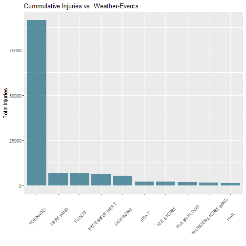

---
output:
  pdf_document: default
  html_document: default
---

## Reproducible Research Course Project 2 - Storm Data Analysis  
####################################################################


Loading libraries

```r
library(readr)
library(data.table)
library(dplyr)
library(ggplot2)
library(lubridate)
library(magrittr)
```


### Synopsis

This R-analysis explores the NOAA Strom Database to evaluate the impact 
of natural disasters (e.g. tornados, hurricanes, ...) on public health and
the economy (property damage) in the US. 

### Get the data

1. Data is downloaded from the following 
URL: https://www.coursera.org/learn/reproducible-research/peer/OMZ37/course-project-2 and the 
Link: Storm Data [47 Mb] is used.

2. For understanding the data set the mentioned documentation is used (ref. National Weather Service- Link: Storm Data Documentation)


### Load the data


```r
storm <- read.table("./repdata_data_StormData/repdata_data_StormData.csv", 
                   na.strings = c("NA", ""), sep = ",", header=TRUE)
```

### Data Processing I

1. Across the United States, which types of events (as indicated in the EVTYPE) are most harmful with respect to population health (most fatalities and injuries)?

Step 1: Select relevant data variables (columns)


```r
storm <- select(storm, STATE, EVTYPE, FATALITIES, INJURIES, PROPDMG, PROPDMGEXP)
```

Step 2: Sum the fatalities per event type (e.g. tornados, hurricanes, ...) & arrange the result in decreasing order to find the events with most deaths and injuries:


```r
fatal_evtype <- aggregate(storm$FATALITIES, by=list(storm$EVTYPE), sum, na.rm = TRUE)
fatal_evtype <- setNames(fatal_evtype, c("EVTYPE","FATALITIES"))
fatal_evtype <- arrange(fatal_evtype, desc(FATALITIES))
injur_evtype <- aggregate(storm$INJURIES, by=list(storm$EVTYPE), sum, na.rm = TRUE)
injur_evtype <- setNames(injur_evtype, c("EVTYPE","INJURIES"))
injur_evtype <- arrange(injur_evtype, desc(INJURIES))
```

Step 3: Transform Event-Types into factor-variable & make barplots for the top 10 of most hazard weather events:


```r
fatal_evtype <- fatal_evtype[1:10,]
injur_evtype <- injur_evtype[1:10,]
fatal_evtype <- transform(fatal_evtype, EVTYPE   = factor(EVTYPE))
injur_evtype <- transform(injur_evtype, EVTYPE   = factor(EVTYPE))
```

### Results I:


```r
ggplot(fatal_evtype, aes(x=reorder(EVTYPE,-FATALITIES), y=FATALITIES)) + 
    geom_bar(fill=rgb(0.1,0.4,0.5,0.7), stat = "identity") +
    theme(axis.text.x=element_text(angle=45,hjust=0.5,vjust=0.5)) +
    labs(x = "", y = "Total Deaths") +
    labs(title = "Cumulative Deaths vs. Weather-Events") 
```


```r
ggplot(injur_evtype, aes(x=reorder(EVTYPE,-INJURIES), y=INJURIES)) + 
    geom_bar(fill=rgb(0.1,0.4,0.5,0.7), stat = "identity") +
    theme(axis.text.x=element_text(angle=45,hjust=0.5,vjust=0.5)) +
    labs(x = "", y = "Total Injuries") +
    labs(title = "Cummulative Injuries vs. Weather-Events") 
```



### Data Processing II

2. Across the United States, which types of events have the greatest economic consequences?

Step 1: Calculate absolute PROPDMG in US-Dollars (USD) by taking into account 
        PROPDMGEXP (K = kilo, M = million, B = billion)

```r
storm$PROPDMGEXP <- gsub("K", "1E3", storm$PROPDMGEXP)
storm$PROPDMGEXP <- gsub("M", "1E6", storm$PROPDMGEXP)
storm$PROPDMGEXP <- gsub("B", "1E9", storm$PROPDMGEXP)
storm$PROPDMGEXP <- as.numeric(storm$PROPDMGEXP)
```

```
## Warning: NAs durch Umwandlung erzeugt
```

```r
storm <- mutate(storm, PROPDMG = PROPDMG * PROPDMGEXP)
storm <- select(storm, -PROPDMGEXP)
```

Step 2: Sum the property damage per event type & order the result to find the top 10 most costly events.


```r
propdmg_evtype <- aggregate(storm$PROPDMG, by=list(storm$EVTYPE), sum, na.rm = TRUE)
propdmg_evtype <- setNames(propdmg_evtype, c("EVTYPE","PROPDMG"))
propdmg_evtype <- arrange(propdmg_evtype, desc(PROPDMG))
```

Step 3: Transform Event-Types into factor-variable & make barplot


```r
propdmg_evtype <- propdmg_evtype[1:10,]
propdmg_evtype <- transform(propdmg_evtype, EVTYPE = factor(EVTYPE))
```

### Results II:


```r
ggplot(propdmg_evtype, aes(x=reorder(EVTYPE,-PROPDMG), y=PROPDMG/1e9)) + 
    geom_bar(fill=rgb(0.1,0.4,0.5,0.7), stat = "identity") +
    theme(axis.text.x=element_text(angle=45,hjust=0.5,vjust=0.5)) +
    labs(x = "", y = "Property Damage in Billion Dollars") +
    labs(title = "Cumulative Property Damage vs. Weather-Events") 
```


### Conclusion
In absolute terms of all recorded weather events __tornados__ caused the most fatalities (_5633_)/ injuries (_91346_). The most property damage (approximately _140 billion USD_) was caused by __floods__.
